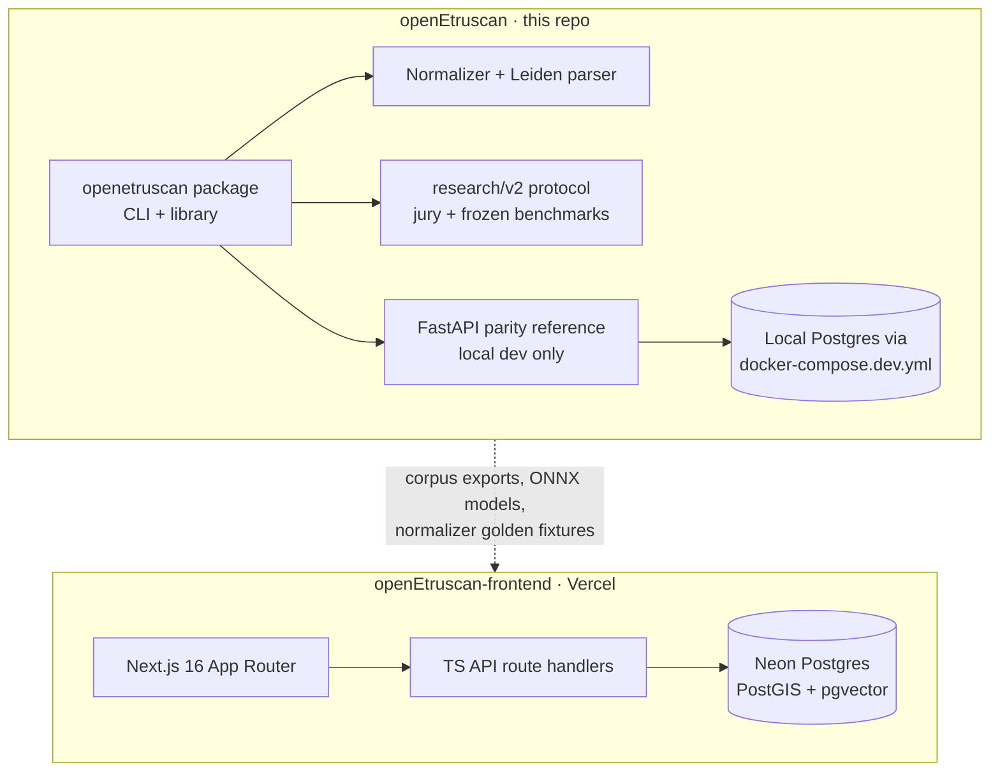

# OpenEtruscan Platform Architecture

Two repositories, one platform (as of 2026-05-24; updated 2026-07-17):

- **This repo (`openEtruscan`)** — the research platform: the `openetruscan`
  Python package (normalizer + Leiden parser, corpus tooling, EpiDoc export,
  prosopography, ML heads), the `research/v2/` annotation/benchmark protocol,
  the Alembic schema, and a **local FastAPI server kept as a parity reference
  and dev convenience** (`uvicorn openetruscan.api.server:app`). It is *not*
  the production HTTP surface.
- **[`openEtruscan-frontend`](https://github.com/Eddy1919/openEtruscan-frontend)** —
  the production website and API: Next.js 16 on Vercel, with the public
  `www.openetruscan.com/api/*` implemented as TypeScript route handlers
  (Drizzle ORM + Neon serverless Postgres). Single origin, no cross-cloud hop.

## The Normalizer Engine (`core/normalizer.py` + `core/leiden.py`)

The heart of the system. Input passes through, in order:

1. **Leiden parse** (`core/leiden.py`) — editorial markup is lifted into a
   structured apparatus *before* anything else sees the text: `[abc]`
   (restoration) → `supplied` span, `(abc)` (abbreviation expansion) → `ex`
   span, `[..]` / `---` → `gap` (with width), underdot / half brackets →
   `unclear`. Canonical text, phonetics, Old Italic, tokens, and the FTS
   index therefore never contain editorial brackets.
2. **Source-system detection** — CIE uppercase, philological, Old Italic
   Unicode, or web-safe.
3. **Folding** — variant → canonical via the per-language YAML adapter
   (`core/adapters/*.yaml`), longest-match digraph resolution, with span
   offsets remapped through every length-changing transform.
4. **Validation** — phonotactic checks emit warnings, never hard failures.
5. **Output** — canonical, IPA, Old Italic, tokens, `apparatus`, warnings,
   confidence.

EpiDoc export (`core/epidoc.py`) serializes the apparatus as real
`<supplied>`, `<ex>`, `<gap>`, `<unclear>` elements.

## Database layer (`db/`)

SQLAlchemy 2.0 async ORM + Alembic migrations (`db/versions/`, exercised by
`tests/test_migrations.py` — the chain bootstraps an empty database). The
schema carries the four-tier `provenance_status` vocabulary and a
`data_sources` table for bibliographic provenance.

> **Known debt:** `core/corpus.py` still contains an older synchronous
> psycopg2 data-access path with its own DDL, used by the CLI. The ORM stack
> is the source of truth; retiring the corpus.py stack is tracked work, not
> an accident.

## Research pipelines (`research/v2/`)

LLM-jury annotation (3 raters, distinct lineages), frozen stratified splits
(committed with SHA256 manifests), bootstrap-CI'd metrics, pre-registration
with a public deviations log. Evidence artifacts live under
`research/v2/results/` and `research/v2/data/`; reproduction steps in
[`docs/REPRODUCE.md`](REPRODUCE.md).

## Historical note

Earlier revisions of this document described a FastAPI + Cloud SQL + GCE
production stack. That stack was retired on 2026-05-24 (Cloud SQL stopped,
VM terminated); the FastAPI app remains in-tree only in the parity/dev role
described above.
