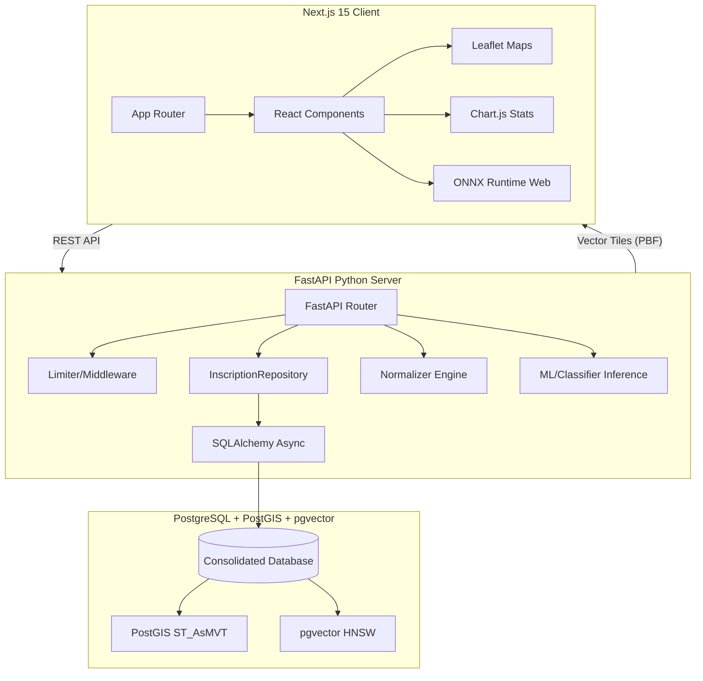
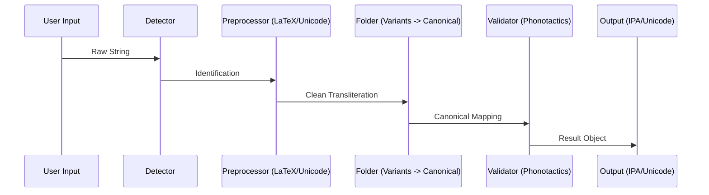
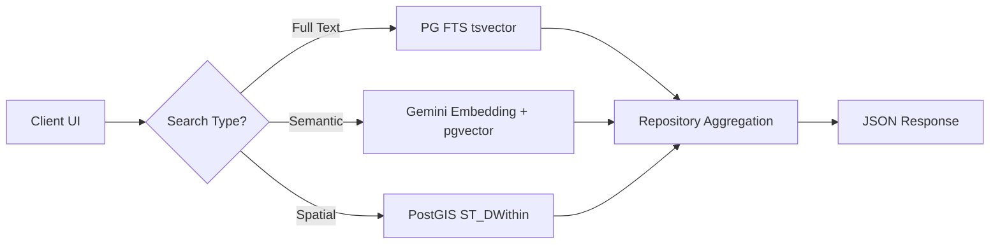

# OpenEtruscan Platform Architecture

OpenEtruscan is a decoupled, multi-tier digital humanities platform designed for high-performance epigraphic analysis.

## Core Stack Overview

## Component Breakdown

### 1. The Normalizer Engine (`core/normalizer.py`)
The "heart" of the system. It handles the transformation of varied epigraphic transcription systems into a canonical phonological representation.

### 2. Database Layer (`db/repository.py`)
A strictly decoupled repository pattern using `SQLAlchemy 2.0` and `pgvector`.
- **Spatial**: Native PostGIS integration for proximity searches (`genetic_samples` x `inscriptions`).
- **Semantic**: Uses `halfvec(3072)` embeddings for cosine similarity across 11,361 records.
- **Tiles**: Direct `ST_AsMVT` generation for high-performance mapping of tens of thousands of points.

### 3. API Middleware (`api/server.py`)
- **Rate Limiting**: Per-endpoint windowed limiting using `slowapi`.
- **Content Negotiation**: Support for JSON, CSV, and GeoJSON exports.
- **Documentation**: Automatic OpenAPI 3.1 generation with Pydantic v2 schemas.

## Data Flow: Search Request

