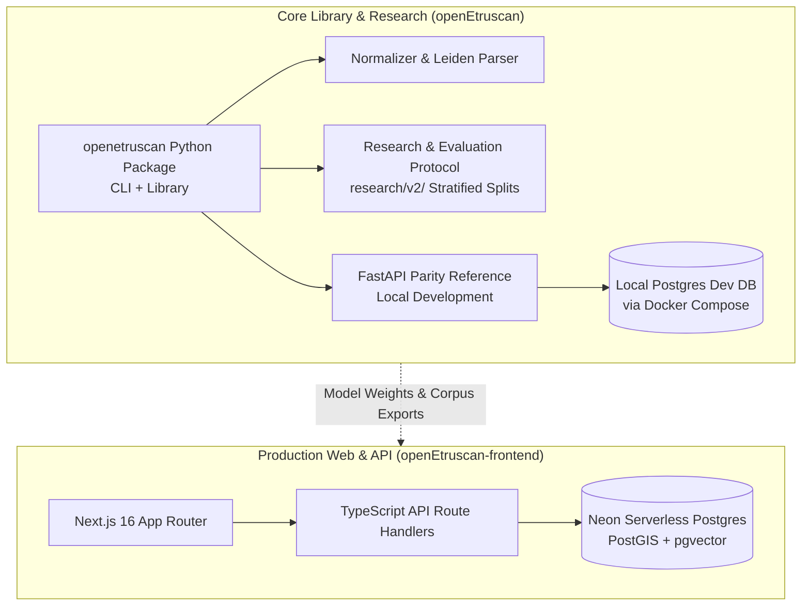

# OpenEtruscan Architecture

OpenEtruscan is organized across two repositories to separate offline research/data pipelines from the production web platform:

1. **`openEtruscan` (This Repository)**: Python core library, CLI tools, Leiden normalization engine, research evaluation harnesses, database migrations, and local development FastAPI server.
2. **[`openEtruscan-frontend`](https://github.com/Eddy1919/openEtruscan-frontend)**: Next.js 16 web application and serverless API route handlers (`app/api/*`) connected to Neon serverless Postgres.

```mermaid
graph TD
    subgraph Production ["Production Web & API (openEtruscan-frontend)"]
        A[Next.js 16 App Router] --> B[TypeScript API Route Handlers]
        B --> C[(Neon Serverless Postgres<br/>PostGIS + pgvector)]
    end

    subgraph Research ["Core Library & Research (openEtruscan)"]
        D[openetruscan Python Package<br/>CLI + Library] --> E[Normalizer & Leiden Parser]
        D --> F[Research & Evaluation Protocol<br/>research/v2/ Stratified Splits]
        D --> G[FastAPI Parity Reference<br/>Local Development]
        G --> H[(Local Postgres Dev DB<br/>via Docker Compose)]
    end

    Research -. Model Weights & Corpus Exports .-> Production
```

---

## 1. Normalization & Leiden Engine (`core/normalizer.py`, `core/leiden.py`)

The normalization pipeline processes epigraphic text through five deterministic stages:

1. **Leiden Apparatus Parsing** (`core/leiden.py`): Extracts editorial markup prior to linguistic processing:
   - `[abc]` (editorial restoration) → `supplied` span
   - `(abc)` (abbreviation expansion) → `ex` span
   - `[..]` or `---` (lacuna) → `gap` (with character width)
   - `ạ` or `⸢a⸣` (unclear reading) → `unclear` span

   Canonical text, phonetic transcriptions, and search tokens stay free of editorial brackets as a result.
2. **Source System Detection**: Identifies whether input is in CIE uppercase, philological Latin, Old Italic Unicode, or web-safe notation.
3. **Orthographic Folding**: Maps variant forms to canonical representations via language adapters (`core/adapters/*.yaml`), resolving multi-character digraphs while preserving source span offsets.
4. **Phonotactic Validation**: Validates syllable structure and outputs warnings on unexpected letter combinations without failing execution.
5. **Multi-Format Output**: Emits canonical text, IPA phonetic transcription, native Old Italic Unicode script, token lists, and structured apparatus objects.

EpiDoc export (`core/epidoc.py`) translates the structured apparatus into standardized TEI XML elements (`<supplied>`, `<ex>`, `<gap>`, `<unclear>`).

---

## 2. Database & Schema Layer (`db/`)

- **ORM & Migrations**: SQLAlchemy 2.0 async models managed by Alembic migrations (`src/openetruscan/db/versions/`).
- **Provenance Modeling**: Implements a four-tier `provenance_status` schema (`acquired_documented`, `acquired_undocumented`, `excavated`, `unknown`) to differentiate attested texts from verified archaeological findspots.
- **Geospatial & Vector Storage**: PostGIS geometries for spatial coordinates and `pgvector` for 3,072-dimensional semantic embeddings.

---

## 3. Epigraphic Machine Learning & Research (`research/v2/`)

- **Stratified Evaluation Splits**: SHA-256 pinned, text-disjoint partitions (`research/v2/data/`).
- **Consensus Annotation Protocol**: Multi-rater consensus scoring with Krippendorff α inter-rater reliability.
- **Statistical Significance**: 10,000-resample bootstrap confidence intervals on all reported metrics.
